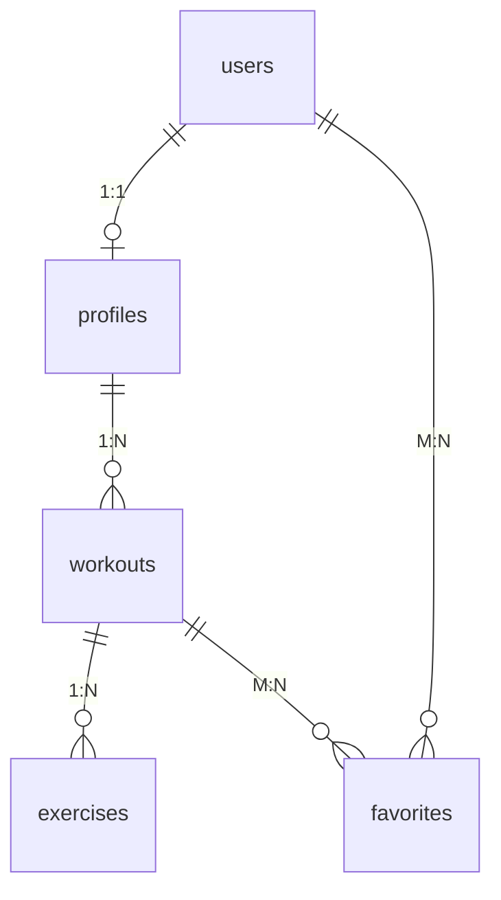

# 🏋️ Get Your Fit Together

A simple fitness tracker built with **Next.js**, **Supabase**, and **Tailwind CSS** for the GoRocky Software Engineer Technical Test.  
It demonstrates full CRUD functionality, authentication, and clear 1:1, 1:N, and M:N database relationships.

---

## 🚀 Live Demo

🔗 **[Live App on Vercel](https://get-your-fit-together-hazel.vercel.app)**  
👤 **Demo Account:**

- Email: `zoepinedatesting@gmail.com`
- Password: `Password123!`

---

## 🧱 Tech Stack

- **Frontend:** Next.js (App Router) + TypeScript + Tailwind CSS
- **Backend:** Supabase (PostgreSQL + Auth)
- **Hosting:** Vercel
- **Auth:** Supabase Auth (Email + Password)

---

## 🧩 Data Model (ERD)



---

## 📂 Local Setup

### 1️⃣ Prerequisites

Make sure you have the following installed:

- **Node.js
  v18** or later

- **Supabase**
  project (free tier)

- **Vercel** CLI
  (optional, for deployment)

- **Git**

### 2️⃣ Clone and Install

```
git clone https://github.com/zowowo/get-your-fit-together.git
cd get-your-fit-together
npm install
```

### 3️⃣ Environment Variables

Create a **.env.local** file in your project root with the following keys:

```
NEXT_PUBLIC_SUPABASE_URL=your_supabase_project_url
NEXT_PUBLIC_SUPABASE_ANON_KEY=your_supabase_anon_key
```

### 4️⃣ Database Setup

1. Open your Supabase Dashboard → SQL Editor.

2. Run or Paste and execute your database schema (migrations/db_schema.sql).

3. Paste and execute supabase/seed.sql

This will create:

- A demo user profile

- Public and private workouts

- Exercises under each workout (1:N)

- Favorites (M:N)

### 5️⃣ Run the Development Server

```
npm run dev
```

Visit http://localhost:3000 to see your app running locally.

## 🧭 Navigation & Access Control

| Route                    | Description                    | Auth Required |
| ------------------------ | ------------------------------ | ------------- |
| /                        | Public Home (Explore Workouts) | ❌            |
| /login, signup           | Authentication pages           | ❌            |
| /dashboard               | User's workout list (CRUD)     | ✅            |
| /dashboard/workouts/[id] | Workout details + exercises    | ✅            |
| /dashboard/favorites     | List of favorited workouts     | ✅            |
| /dashboard/profile       | User profile (1:1)             | ✅            |

### 🔒 Protected Routes:

If a user is **not logged in** and tries to access a protected route, they are **redirected** to /login.

## ✅ Feature Mapping

| Requirement                 | Implementation                      |
| --------------------------- | ----------------------------------- |
| Authentication              | ✅ Supabase Auth (Email + Password) |
| CRUD (Workouts + Exercises) | ✅ Create, Edit, Delete             |
| 1:1 Relationship            | ✅ users ↔ profiles                 |
| 1:N Relationship            | ✅ workouts ↔ exercises             |
| M:N Relationship            | ✅ favorites, user_workouts         |
| Access Control              | ✅ AuthGuard + redirects            |
| Responsive Design           | ✅ Tailwind CSS, Shadcn, MaterialUI |
| Seed Data                   | ✅ supabase/seed.sql                |

## SDLC Notes

This project followed an incremental development lifecycle:

1. Plan — Defined entities and relationships in Supabase schema.

2. Implement — Started with authentication and 1:1 profile.

3. Iterate — Added CRUD for workouts and exercises.

4. Expand — Introduced favorites (M:N) and UI polish.

5. Test & Deploy — Seeded demo data, verified flows, deployed to Vercel.

This approach ensures every rubric requirement is verifiable step-by-step

## 🧰 AI Tools Used

| Tool                               | Purpose                                            |
| ---------------------------------- | -------------------------------------------------- |
| ChatGPT (GPT-5), Claude Sonnet 3.5 | Schema design, documentation, seed data generation |
| Cursor, Microsoft Copilot          | Code navigation and Next.js routing scaffolding    |
| Windsurf, Uizard                   | Frontend prototyping and layout testing            |
